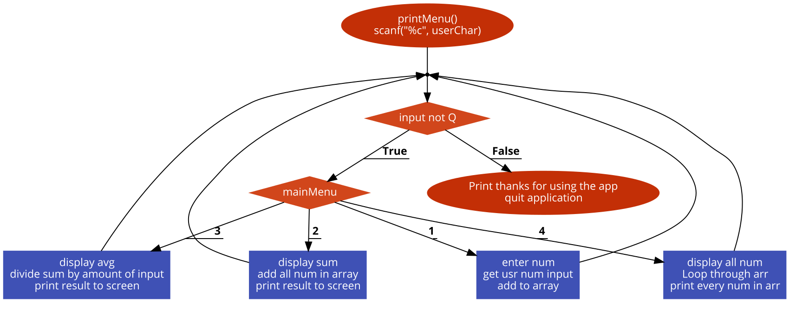

# Chance Gurley Array Design Tool

**Flow Chart:**

**Variables:**
- userChar
- validChar
- userInt
- avgResult
- sumResult
- result
- arr[1000]
- arrSize
- goAgain
- programRestart

**Functions:**
- int addToArr(int arr[], int arrSize)
- int avgArr(int arr[], int arrSize)
- int sumArr(int arr[], int arrSize)
- void showArr(int arr[], int arrSize)
- void printMenu(int i)
- char getValidCharInput()